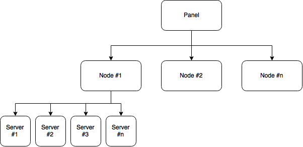

# 术语表
**面板** - 这是指 Pterodactyl 翼龙面板本身，它允许您向系统添加其他节点和服务器。

**节点** - 节点是运行 Daemon 程序实例的物理机器。

**守护进程** - 用 Nodejs 编写的服务，与 Docker 和面板连接，为通过面板控制服务器提供安全访问。

**服务器** - 在这种情况下，服务器引用由面板创建的正在运行的实例。这些服务器是在节点上创建的，每个节点可以有多个服务器。

**容器** - 每个服务器将在隔离容器内运行，以强制实施硬件限制（例如 CPU 和 RAM），并避免一个节点上的服务器之间的任何干扰。这些是由 Docker 创建的。

**Nest** - 每个巢（Nest）通常用作特定的游戏或服务，例如：Minecraft，Teamspeak 或 Terraria，可以包含许多 Egg。

**Egg** - 每个蛋（Egg）通常用于存储特定类型游戏的配置，例如：Vanilla，Spigot 或 Bungeecord。

**安装时** - 指服务器处于安装阶段。该阶段，用户访问服务器会获得正在安装的提示，并且看到进度条。

**运行时** - 指服务器在安装完成后的阶段。该阶段用户访问服务器可以见到完整的控制台和统计信息。
## 配置关系示例图

